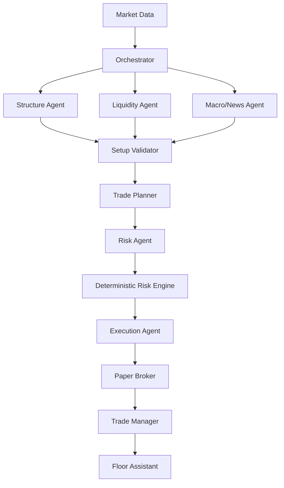

# Trading Floor V2 — Architecture

## Diagrama



## Fronteras

### Market Data

Obtiene y normaliza barras, sesiones, timeframes, símbolos, timezone, fuente y calidad. Debe distinguir vela cerrada de vela en formación. No decide setups ni riesgo.

### Structure Agent

Analiza estructura multi-timeframe: tendencia, soportes, resistencias, desplazamientos y retrocesos. Las definiciones computables deben estar documentadas; las heurísticas deben etiquetarse como tales.

### Liquidity Agent

Detecta zonas, sweeps, order blocks y posibles reacciones según definiciones explícitas. No convierte una heurística en una verdad de mercado.

### Macro/News Agent

Entrega eventos macro y noticias con fuente y timestamp. Si no hay datos, devuelve `NO_DATA`; nunca inventa contexto.

### Setup Validator

Combina evidencia y produce `NO_SETUP`, `WATCH` o `VALID_SETUP`. No calcula sizing ni autoriza riesgo.

### Trade Planner

Convierte un setup válido en una propuesta LONG/SHORT con entrada, invalidación, stop, target, R:R y condiciones de cancelación.

### Risk Agent

Interpreta la propuesta y prepara la solicitud al motor determinista. No es la autoridad matemática final.

### Deterministic Risk Engine

Valida límites, dirección, stop, target, R:R, valor monetario por punto/tick y cantidad. Produce `APPROVED` o `REJECTED`. Ningún agente puede saltárselo.

### Execution Agent / Paper Broker

Ejecuta solo planes autorizados en paper trading. No reinterpreta la estrategia.

### Trade Manager

Mantiene estado, SL/TP, fills, cancelaciones y posiciones. No mueve stops arbitrariamente.

### Floor Assistant

Resume evidencia, estados, riesgo, órdenes paper y decisiones. No toma decisiones financieras.

## Contratos mínimos

Usar dataclasses o TypedDict versionados. Todo mensaje importante debe incluir como mínimo:

```text
schema_version
run_id
timestamp
symbol
timeframe
agent
status
evidence
reasoning_summary
data_quality
warnings
```

Estados técnicos base: `OK`, `PARTIAL`, `NO_DATA`, `ERROR`.

Contratos específicos posteriores:

- `MarketBar`: OHLCV, símbolo, timeframe, timestamp, timezone, fuente, `is_closed`.
- `SetupAssessment`: estado, side, timeframes, evidencia e invalidación.
- `TradePlan`: side, entry, stop, target, R:R, invalidación y cancelación.
- `RiskDecision`: estado, cantidad, capital en riesgo, niveles y motivo.

## Determinismo

Indicadores, estructura formal, niveles, sizing, riesgo, ejecución paper, PnL, equity, drawdown y autorización son deterministas. La IA solo interpreta, clasifica, sintetiza y explica.

## Compatibilidad temporal

Preservar no-lookahead, train/test, contexto histórico de prueba, mark-to-market, posiciones abiertas, costes una sola vez y política conservadora intrabar.
