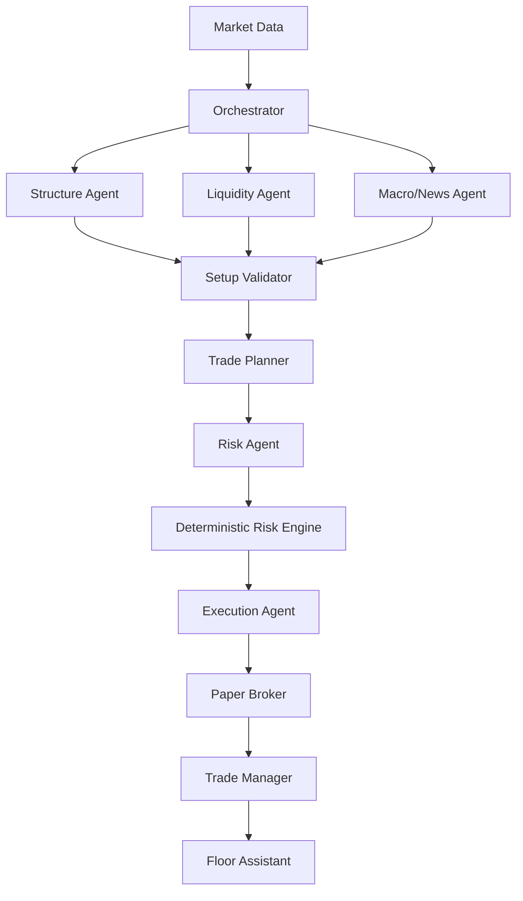
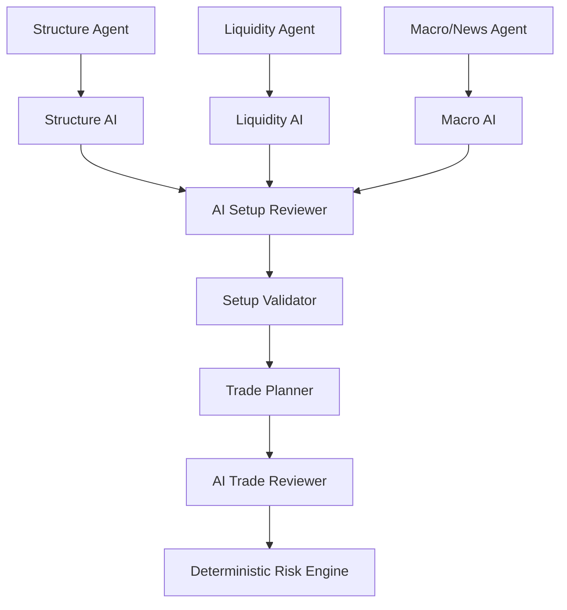

# Trading Floor V2 — Architecture

## Operational layer (Fase 6C)

`runtime.service.OperationalRuntime` coordinates the session scheduler, closed-bar freshness gate, deterministic Floor Orchestrator, AI Orchestrator, final PAPER policy gate, existing Paper Broker and Trade Manager, and SQLite repository. `storage.database.Store` persists reports, paper state, journal, slots, health, and read-only UI snapshots. `runtime.scheduler` uses `zoneinfo` for London/New York analysis windows. The UI reads SQLite read-only and never triggers a cycle. The scheduler triggers but never authorizes. Only `PLAN_READY` with RiskDecision APPROVED and valid review can reach the Paper Broker; AI_CAUTION blocks progression. Details: `OPERATIONAL_RUNTIME_SPEC.md`.

## Diagrama



## Fronteras

### Market Data

Obtiene y normaliza barras, sesiones, timeframes, símbolos, timezone, fuente y calidad. Debe distinguir vela cerrada de vela en formación. No decide setups ni riesgo.

### Structure Agent

Analiza estructura multi-timeframe: tendencia, soportes, resistencias, desplazamientos y retrocesos. Las definiciones computables deben estar documentadas; las heurísticas deben etiquetarse como tales.

### Liquidity Agent

Detecta zonas, sweeps, order blocks y posibles reacciones según definiciones explícitas. No convierte una heurística en una verdad de mercado.

### Macro/News Agent

Entrega eventos macro y noticias con fuente y timestamp. Si no hay datos, devuelve `NO_DATA`; nunca inventa contexto.

### Setup Validator

Combina evidencia y produce `NO_SETUP`, `WATCH` o `VALID_SETUP`. No calcula sizing ni autoriza riesgo.

### Trade Planner

Convierte un setup válido en una propuesta LONG/SHORT con entrada, invalidación, stop, target, R:R y condiciones de cancelación.

### Risk Agent

Interpreta la propuesta y prepara la solicitud al motor determinista. No es la autoridad matemática final.

### Deterministic Risk Engine

Valida límites, dirección, stop, target, R:R, valor monetario por punto/tick y cantidad. Produce `APPROVED` o `REJECTED`. Ningún agente puede saltárselo.

### Execution Agent / Paper Broker

Ejecuta solo planes autorizados en paper trading. No reinterpreta la estrategia.

### Trade Manager

Mantiene estado, SL/TP, fills, cancelaciones y posiciones. No mueve stops arbitrariamente.

### Floor Assistant

Resume evidencia, estados, riesgo, órdenes paper y decisiones. No toma decisiones financieras.

## Contratos mínimos

Usar dataclasses o TypedDict versionados. Todo mensaje importante debe incluir como mínimo:

```text
schema_version
run_id
timestamp
symbol
timeframe
agent
status
evidence
reasoning_summary
data_quality
warnings
```

Estados técnicos base: `OK`, `PARTIAL`, `NO_DATA`, `ERROR`.

Contratos específicos posteriores:

- `MarketBar`: OHLCV, símbolo, timeframe, timestamp, timezone, fuente, `is_closed`.
- `SetupAssessment`: estado, side, timeframes, evidencia e invalidación.
- `TradePlan`: side, entry, stop, target, R:R, invalidación y cancelación.
- `RiskDecision`: estado, cantidad, capital en riesgo, niveles y motivo.

## Determinismo

Indicadores, estructura formal, niveles, sizing, riesgo, ejecución paper, PnL, equity, drawdown y autorización son deterministas. La IA solo interpreta, clasifica, sintetiza y explica.

## Compatibilidad temporal

Preservar no-lookahead, train/test, contexto histórico de prueba, mark-to-market, posiciones abiertas, costes una sola vez y política conservadora intrabar.

## Capa de agentes IA (Fase 6A)



Regla central: **AI interprets. Python validates. Risk Engine authorizes. Paper Broker executes.**

- `ai/contracts.py`: `AIRequest`/`AIResponse`/`AIFloorReport` versionados y frozen; `validate_ai_response` es la única puerta de entrada de una respuesta IA hacia el resto del sistema.
- `ai/provider.py`: interfaz `AIProvider.generate(request) -> AIResponse`; `DeterministicAIProvider` (por defecto, sin red) y `FakeAIProvider` (pruebas). Un proveedor LLM real puede añadirse implementando la misma interfaz sin tocar Risk Engine, Paper Broker ni scouts deterministas.
- `ai/runtime.py`: invoca al proveedor, valida el grounding, aísla fallos (`ERROR` en vez de excepción propagada), evita llamadas sin evidencia (`NO_DATA`) y registra un `AuditLog` en memoria.
- `ai/agents/`: Structure AI, Liquidity AI, Macro AI, AI Setup Reviewer y AI Trade Reviewer. Ninguno inventa evidencia; cada uno solo cita `evidence_id` recibidos en el `AIRequest`.
- `ai/orchestrator.py`: capa de composición sobre un `FloorRunReport` ya calculado por `floor/orchestrator.py` (sin modificarlo). Nunca convierte `NO_SETUP`/`WATCH`/`RISK_REJECTED` en un estado ejecutable; solo puede añadir `AI_CAUTION` cuando un `PLAN_READY` recibe una revisión IA adversa, sin alterar el `RiskDecision`.

`REAL_EXECUTION` permanece `DISABLED`. El módulo `ai/` no importa `execution.paper_broker` ni `execution.trade_manager`.

## Demo Runner PAPER (Fase 7)

`runtime.demo_runner.DemoRunner` coordina el runtime existente por slot de 15 minutos con un `run_id` durable, provider Twelve Data, cinco roles IA OpenAI cuando existe evidencia, validación/setup, Risk Engine y Paper Broker. El scheduler sigue deshabilitado para el experimento. `dry_run` bloquea todas las mutaciones de Paper Broker y Trade Manager durante diagnóstico live. No hay ejecución real.

SQLite schema 2 agrega `review_reports` y `notification_events`. Los resúmenes y referencias de evidencia permiten reconstruir la decisión sin almacenar razonamiento privado. Los eventos se derivan del journal y se guardan antes de enviarlos por `NotificationSink`; la UI abre la base solo en modo lectura. La migración desde schema 1 preserva runs, cuenta y journal. Detalles de contratos y gates: `DEMO_RUNNER_SPEC.md`; procedimiento de verificación: `PHASE7_CERTIFICATION.md`.

## Preparación cloud posterior a Fase 7

`render.yaml` propone un servicio web Render de una instancia con disco persistente montado en `data/runtime`. `runtime.cloud` supervisa Streamlit y, solo tras activación futura explícita, un proceso `runtime.cloud_runner` con lock exclusivo en el disco. El dashboard solo lee SQLite y nunca ejecuta ciclos. Runner y scheduler están deshabilitados en el Blueprint. SQLite schema 3 añade el registro de intentos de entrega Slack y la deduplicación de alertas macro; la migración conserva los datos de schema 2.

`FinnhubMacroDataProvider` implementa `MacroDataProvider` para Economic Calendar con UTC, caché y filtro por `as_of`, pero permanece SUPPORTED / NOT_ACTIVE / NOT_CERTIFIED tras HTTP 403 en el plan Free. FRED/ALFRED no se activa como reemplazo único: sus release dates no ofrecen hora exacta y sus observaciones/vintages no aportan consenso ni severidad. `AI_FLOOR_MACRO_PROVIDER=none` mantiene el gate cerrado. Los eventos se guardan antes de intentar enviarlos a Slack; un `event_id` se intenta a lo sumo una vez después de reinicios. Ver `CLOUD_READINESS_SPEC.md`, `FRED_ALFRED_EVALUATION.md` y `AUDIT_POST_PHASE7.md`.

`OfficialMacroProvider` usa calendarios ICS de BLS/BEA/Eurostat y RSS de Fed/BCE sin claves ni HTML scraping. Acepta hora UTC solo si está explícita, o fecha sola con precisión marcada; conserva URL, UID, publicación/actualización si consta y `fetched_at`. No sintetiza actual, anterior, forecast, consenso ni importancia. La relevancia HIGH es una política determinista interna y se alerta aparte de importancia informada por un proveedor. Caché seis horas, backoff de fallo una hora, y salud parcial explícita evitan consultas por cada ciclo y falsa completitud. `ReviewReport.macro_evidence` conserva la evidencia aceptada por `as_of`. La certificación externa es insuficiente: BLS no fue accesible y los RSS de Fed/BCE no anuncian decisiones futuras. El modo queda disponible para evaluar, pero no activo en el Blueprint ni autorizado para cloud.

Con la búsqueda macro diferida, `AI_FLOOR_MACRO_PROVIDER=none` selecciona `NoMacroDataProvider` y produce `NO_DATA` sin evidencia. `runtime.cloud.cloud_preflight` distingue `INFRA_READY` de `experiment_ready`; solo el primero permite iniciar el dashboard privado de solo lectura, mientras el segundo permanece falso por macro no certificado. El supervisor y el runner verifican el gate de experimento antes de iniciar cualquier scheduler. El lock de archivo en el disco y `numInstances: 1` preservan una única autoridad PAPER; estado y entregas Slack viven en SQLite durable. No se ha desplegado ni activado el experimento.
